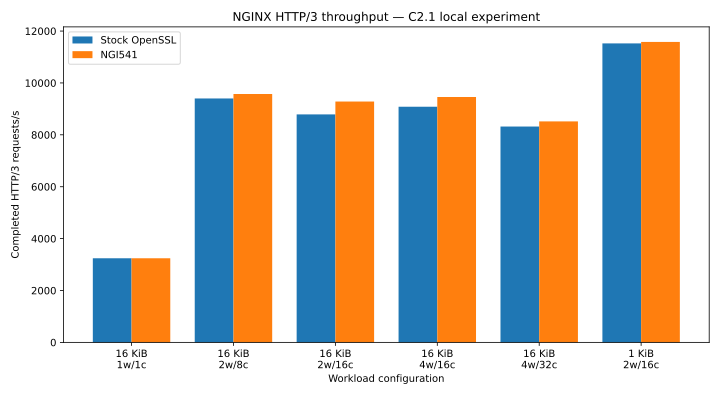
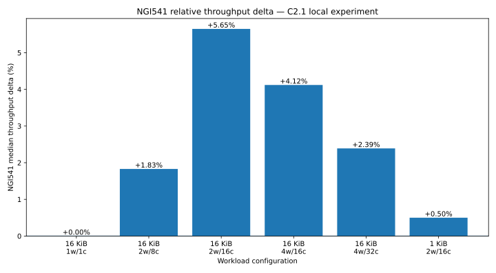

# C2.1 local HTTP/3 experiment

`c2.1-local-http3` freezes the first accepted local performance experiment for the NGI541 NGINX HTTP/3 integration.

The experiment predates the reusable benchmark framework now being introduced in this repository. Historical artifacts are therefore preserved separately from the portable benchmark machinery.

## Purpose

The experiment evaluates the NGINX HTTP/3 server path with two server-side cryptographic execution configurations:

- stock OpenSSL packet-protection path;
- NGI541 direct prepared-key execution for the supported AES QUIC path.

The primary metric is completed HTTP/3 requests per second.

The local experiment is preliminary evidence. It is not a substitute for dedicated client/server characterization.

## Topology

The experiment used a single-host loopback topology:

```text
load generator  ⇄  127.0.0.1:8443  ⇄  NGINX SUT
```

Client and server therefore shared CPU resources and host scheduling.

This topology is classified as `T0 — local single-host` in [`../../docs/topology.md`](../../docs/topology.md).

## Workload

The accepted summary contains the following configurations:

| Payload | Workers | Clients | Stock median req/s | NGI541 median req/s | Median delta |
| --- | ---: | ---: | ---: | ---: | ---: |
| 16 KiB | 1 | 1 | 3242.79 | 3242.95 | ~0.00% |
| 16 KiB | 2 | 8 | 9400.27 | 9572.33 | +1.83% |
| 16 KiB | 2 | 16 | 8786.95 | 9283.03 | +5.65% |
| 16 KiB | 4 | 16 | 9082.30 | 9456.88 | +4.12% |
| 16 KiB | 4 | 32 | 8319.39 | 8518.44 | +2.39% |
| 1 KiB | 2 | 16 | 11524.20 | 11581.57 | +0.50% |

The machine-readable form is in [`processed/summary.csv`](processed/summary.csv).

## Interpretation

The low-concurrency and small-payload points are approximately at parity.

The strongest repeatable signal appears in sustained multi-connection 16 KiB workloads at 2 workers / 16 clients and 4 workers / 16 clients, where the median throughput advantage is approximately 4–6%.

The 2-worker / 8-client result is positive by median, but the accepted 10-round set contains two pathological NGI541 drops and is therefore not used as the basis of the 4–6% project claim.

The 4-worker / 32-client point is interpreted cautiously because the single-host environment is already materially affected by host-level saturation.

## Result provenance

Per-run benchmark measurements containing the accepted RPS values were not preserved as standalone machine-readable artifacts.

The accepted summary was reconstructed from the original benchmark session record. Historical runners, NGINX configurations, payloads, NGI541 runtime identity, source-state evidence, build configuration, and integration provenance were preserved independently.

See:

- [`raw/README.md`](raw/README.md)
- [`provenance/README.md`](provenance/README.md)
- [`historical/README.md`](historical/README.md)

## Historical source and canonical source

The historical benchmark source state and the later frozen C2.1 source commit are not represented as byte-identical identities.

Historical benchmark source:

```text
NGI541 version: 0.1.1
base commit: f783e4cf99aa20d68b64cc893a60c257c02898e6
plus preserved uncommitted direct-prepared working-tree changes
```

Frozen C2.1 source:

```text
e78865845aaa033330b00892388d9d5af749d971
```

The frozen commit includes a post-benchmark correction restoring the public `NOT_INITIALIZED` error contract for invalid prepared-execution calls. That correction is confined to the invalid-key path and does not add an engine-state check to valid prepared-key execution.

## Historical runtime

The accepted corrected benchmark phase used the Release/AVX2 NGI541 runtime profile.

Preserved runtime fingerprint:

```text
f63e60ba04e5f2cdd4876f0ac416e17c4e533658b68b6e732a4dba5ee9f96f3e
```

The exact final corrected NGINX executable used for the accepted measurements was not preserved byte-for-byte.

## Cipher selection

The NGINX benchmark configuration did not itself force the TLS 1.3 cipher suite.

The historical benchmark runners explicitly used:

```text
--tls13-ciphers TLS_AES_128_GCM_SHA256
```

For this path:

- QUIC packet protection uses AES-128-GCM;
- the NGI541 integration implements the AES-based QUIC header-protection execution through its prepared AES-CTR primitive.

This implementation mechanism must not be confused with a TLS AES-CTR cipher suite.

## Figures





The figures are deterministically generated from `processed/summary.csv` by [`analysis/render_figures.py`](analysis/render_figures.py).

## Scope

This experiment does not establish:

- universal superiority over OpenSSL;
- latency improvement;
- CPU-efficiency improvement;
- cycles-per-byte improvement;
- cross-platform performance;
- AMD or ARM64 performance;
- causal attribution of the end-to-end difference to AES-GCM alone;
- bit-identical historical binary reproducibility.

The accepted project-facing performance claim is recorded under [`../../evidence/performance/c2.1-local-http3/`](../../evidence/performance/c2.1-local-http3/).
